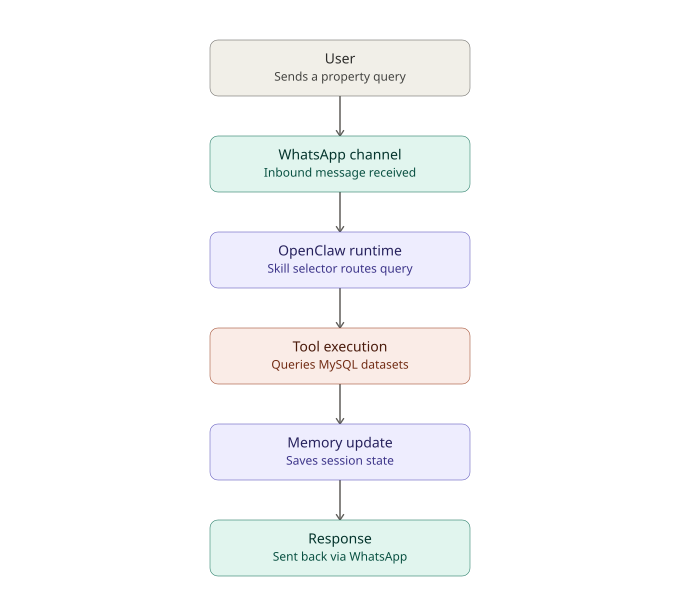

# IDX Exchange — Agent Architecture Documentation

## Overview

This document walks through how a single user query flows end-to-end through the IDX Exchange multi-agent system: from the moment a message arrives over WhatsApp, through OpenClaw's runtime and skill routing, into the MLS database layer, and back to the user as a formatted response.

## The flow, stage by stage

**1. User**
A user sends a natural-language property question over WhatsApp — for example, "Show me 3-bedroom condos in Irvine under $1.5M."

**2. WhatsApp channel**
OpenClaw's WhatsApp channel integration receives the inbound message and passes it into the Gateway. This link has been verified end-to-end — a test message round-trips through the Gateway and back correctly, even in cases where a downstream call (like the LLM request) fails.

**3. OpenClaw runtime — skill selector**
The runtime's orchestrator inspects the incoming message and decides which skill (or combination of skills) should handle it. In the full system this becomes the multi-agent router, dispatching to `propertySearchAgent`, `marketStatsAgent`, `recommendationAgent`, `ragAgent`, or `emailDraftAgent` depending on intent.

**4. Tool execution**
The selected skill calls out to a typed tool function, which is where the real work happens. For this project, that means parameterized, safe SQL queries against the two core MLS datasets:
- `rets_property` — 55,212 active listings (130+ fields)
- `california_sold` — 98,552 sold transactions (46 fields)

A third dataset, `rets_openhouse` (13,433 records), has also been imported and is available for future use alongside the two core tables.

**5. Memory update**
After the tool call completes, OpenClaw updates the session's short-term memory — tracking conversation state so a user can ask a follow-up question ("now only ones with a pool") without repeating their full criteria.

**6. Response**
The formatted result is sent back out through the same WhatsApp channel, completing the round trip.

## Why this matters

Every specialized agent in the system is really just a different implementation of steps 3 and 4 above — a different skill being selected, and a different tool being called. The architecture itself doesn't change; what changes is which tool gets executed and what it does with the MLS databases.
